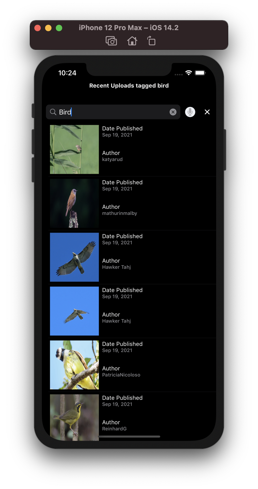
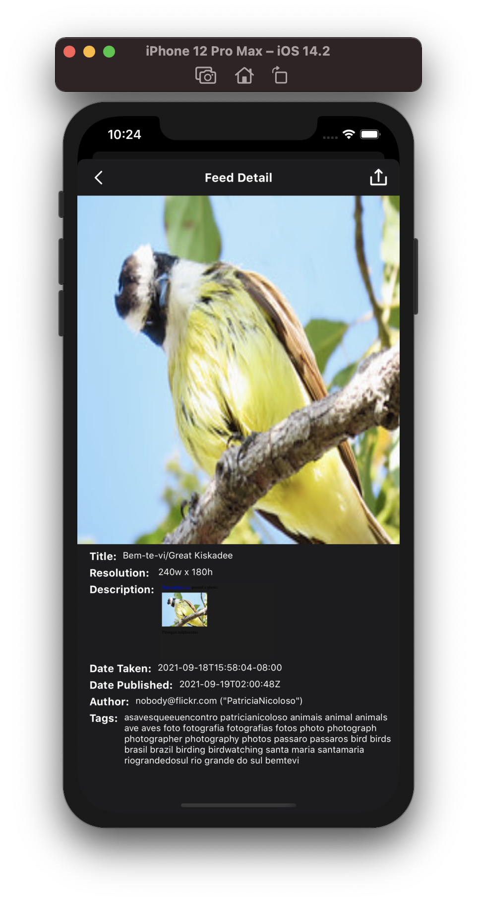
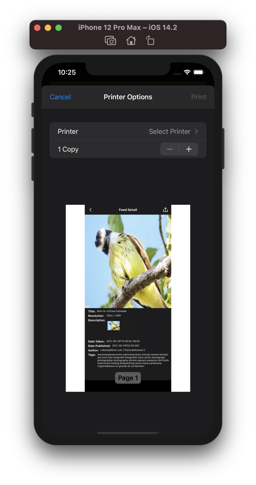

# Image Detector

Image detector will get list of public content matching some tags and display feed image as a list along with author and publish date. Image detector application utilized MVVM architecture. Image detector will allow user to search feed by voice when user tap on the microphone button on the Home Screen. Image detector will support both dark and light mode.

# Light Mode

# Dark Mode

